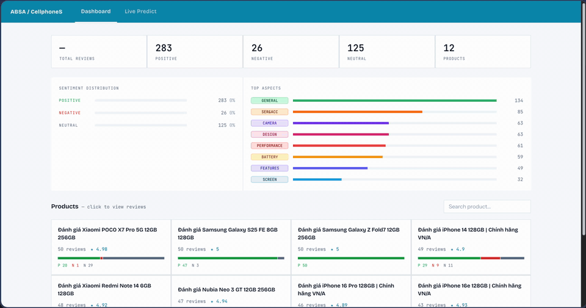

# Vietnamese ABSA — Aspect-Based Sentiment Analysis system for CellphoneS Reviews

An **Aspect-Based Sentiment Analysis (ABSA)** system for Vietnamese cellphone reviews, covering the full pipeline from data collection and model training to a production-ready web application.

---

## Demo



---

## System Overview

```
Crawl data  →  Train models  →  Batch inference  →  Web App
 (Scrapy)      (Notebooks)    (script/inference.py)  (FastAPI + React)
```

The system is broken into two sub-tasks handled by two fine-tuned models:

### Sub-task 1 — Aspect Span Detection (NER)

Identify which text spans mention a specific product aspect.  
Model: `NlpHUST/ner-vietnamese-electra-base` (token classification, BIO tagging)

| Aspect | Meaning |
|--------|---------|
| `BATTERY` | Battery life, charging speed |
| `CAMERA` | Camera quality, photography features |
| `DESIGN` | Appearance, build quality, form factor |
| `FEATURES` | Software features, specifications, capabilities |
| `GENERAL` | Overall impression, unspecified aspects |
| `PERFORMANCE` | Processing speed, lag, heating, stability |
| `PRICE` | Price, value for money, promotions |
| `SCREEN` | Display quality, brightness, resolution |
| `SER&ACC` | Customer service, warranty, accessories |
| `STORAGE` | Internal storage, memory capacity |

### Sub-task 2 — Sentiment Classification (SA)

Classify the sentiment expressed toward each detected aspect (and the review overall).  
Model: `vinai/phobert-base-v2` (sequence classification, ABSA pair format: `<aspect span> : <full text>`)

| Sentiment | Meaning |
|-----------|---------|
| `POSITIVE` | The reviewer expresses satisfaction or praise |
| `NEGATIVE` | The reviewer expresses dissatisfaction or criticism |
| `NEUTRAL` | The reviewer is neutral or merely descriptive |

---

## Dataset — UIT-ViSD4SA

Both models are trained on **[UIT-ViSD4SA](https://github.com/kimkim00/UIT-ViSD4SA)**, a Vietnamese sentiment dataset for aspect-based analysis of smartphone reviews.

Data format (JSONL):
```json
{ "text": "Man hinh dep, pin trau nhung camera hoi thuong.", "labels": [[0, 8, "SCREEN#POSITIVE"], [10, 19, "BATTERY#POSITIVE"], [28, 34, "CAMERA#NEGATIVE"]] }
```

---

## Model Performance

### NER Model — Aspect Span Detection

Fine-tuned from `NlpHUST/ner-vietnamese-electra-base`. Evaluated with token-level weighted-average F1.
Training code: [`notebook/Electra_NER.ipynb`](notebook/Electra_NER.ipynb)

| Aspect | Precision | Recall | F1-score |
|--------|-----------|--------|----------|
| BATTERY | 0.8367 | 0.8551 | 0.8458 |
| CAMERA | 0.8016 | 0.8622 | 0.8308 |
| DESIGN | 0.7610 | 0.8065 | 0.7831 |
| FEATURES | 0.7349 | 0.7550 | 0.7448 |
| GENERAL | 0.7374 | 0.7646 | 0.7508 |
| PERFORMANCE | 0.7667 | 0.7839 | 0.7752 |
| PRICE | 0.5612 | 0.5901 | 0.5753 |
| SCREEN | 0.6974 | 0.7567 | 0.7258 |
| SER&ACC | 0.7566 | 0.7559 | 0.7563 |
| STORAGE | 1.0000 | 0.0038 | 0.0077 |
| **weighted avg** | **0.7632** | **0.7822** | **0.7700** |

### SA Model — Sentiment Classification

Fine-tuned from `vinai/phobert-base-v2`. Uses an ABSA pair input format (`<aspect span> : <full text>`).
Training code: [`notebook/Transformer_SA.ipynb`](notebook/Transformer_SA.ipynb)

| Sentiment | Precision | Recall | F1-score |
|-----------|-----------|--------|----------|
| NEGATIVE | 0.9498 | 0.9125 | 0.9307 |
| NEUTRAL | 0.5675 | 0.6944 | 0.6246 |
| POSITIVE | 0.9618 | 0.9549 | 0.9583 |
| **weighted avg** | **0.9277** | **0.9211** | **0.9238** |

---

## Project Structure

```
├── backend/
│   ├── main.py          # FastAPI app (REST API + static file serving)
│   └── predictor.py     # NER + SA inference pipeline
├── crawler/
│   ├── spiders/
│   │   └── reviews.py   # Scrapy + Playwright spider for cellphones.com.vn
│   ├── items.py
│   ├── pipelines.py
│   └── settings.py
├── data/
│   ├── crawled/         # Raw reviews from the crawler
│   ├── inferenced/      # ABSA-labeled reviews (output of inference.py)
│   └── train/           # UIT-ViSD4SA splits (train / dev / test JSONL)
├── frontend/            # React 18 + Vite + Tailwind CSS
│   └── src/pages/
│       ├── Dashboard.jsx   # Review browser & analytics dashboard
│       └── Predict.jsx     # Real-time ABSA prediction page
├── models/
│   ├── NER/             # Fine-tuned ELECTRA NER model
│   ├── SA/              # Fine-tuned PhoBERT SA model
│   └── vncorenlp/       # VnCoreNLP word segmenter
├── notebook/
│   ├── Electra_NER.ipynb      # NER model training
│   ├── Transformer_SA.ipynb   # SA model training
│   └── predict.ipynb          # Inference demo
├── script/
│   └── inference.py     # Batch inference over all crawled data
└── pyproject.toml
```

---

## Requirements

- Python >= 3.10
- Node.js >= 18
- GPU with CUDA recommended for faster inference

---

## Installation

### 1. Python dependencies

```bash
python -m venv .venv
source .venv/bin/activate       # Windows: .venv\Scripts\activate
pip install -e .
```

### 2. Playwright (used by the crawler)

```bash
playwright install chromium
```

### 3. Frontend dependencies

```bash
cd frontend
npm install
```

---

## Usage

### Step 1 — Crawl data

```bash
cd crawler
scrapy crawl cellphones_reviews -s MAX_PRODUCTS=50 -s MAX_REVIEWS=100
```

Output saved to `data/crawled/cellphones.jsonl`.

| Parameter | Description | Default |
|-----------|-------------|---------|
| `MAX_PRODUCTS` | Maximum number of products to crawl | Unlimited |
| `MAX_REVIEWS` | Maximum reviews per product | Unlimited |

### Step 2 — Batch inference

Run the ABSA pipeline over all crawled reviews:

```bash
python script/inference.py
```

Output saved to `data/inferenced/cellphones.jsonl`.

### Step 3 — Run the web app

Start the backend:

```bash
uvicorn backend.main:app --reload --port 8000
```

Start the frontend dev server (in a separate terminal):

```bash
cd frontend
npm run dev
```

Visit [http://localhost:5173](http://localhost:5173). API requests are proxied to the backend at `http://localhost:8000`.

---

## API Endpoints

| Endpoint | Method | Description |
|----------|--------|-------------|
| `GET /api/products` | GET | List all products with review statistics |
| `GET /api/reviews` | GET | List reviews with filter & pagination |
| `POST /api/predict` | POST | Run ABSA on a given Vietnamese text |

**Query parameters for `/api/reviews`:**

| Parameter | Description |
|-----------|-------------|
| `product` | Filter by product slug |
| `sentiment` | Filter by sentiment (`POSITIVE` / `NEGATIVE` / `NEUTRAL`) |
| `aspect` | Filter by aspect (e.g. `BATTERY`, `CAMERA`) |
| `page` | Page number (default: 1) |
| `size` | Items per page, 1–100 (default: 20) |

---

## Web Interface

- **Dashboard** — Sentiment distribution statistics, review browser with filtering by product / aspect / sentiment. Aspect spans are highlighted inline within each review.
- **Predict** — Enter any Vietnamese text and receive real-time ABSA results with color-coded aspect highlights and per-aspect sentiment labels.

---

## Tech Stack

| Component | Technology |
|-----------|------------|
| Crawling | Scrapy + Playwright |
| NLP Preprocessing | VnCoreNLP (word segmentation) |
| Deep Learning | PyTorch + HuggingFace Transformers |
| NER Model | ELECTRA (`NlpHUST/ner-vietnamese-electra-base`) |
| SA Model | PhoBERT (`vinai/phobert-base-v2`) |
| Training Dataset | UIT-ViSD4SA |
| Backend API | FastAPI + Uvicorn |
| Frontend | React 18 + Vite + Tailwind CSS |
| Data format | JSONL |
